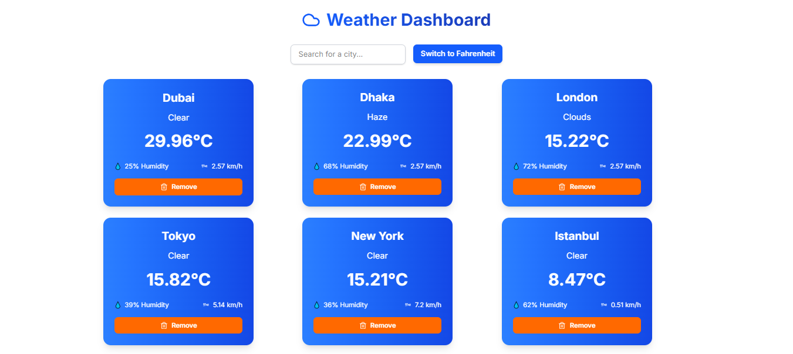
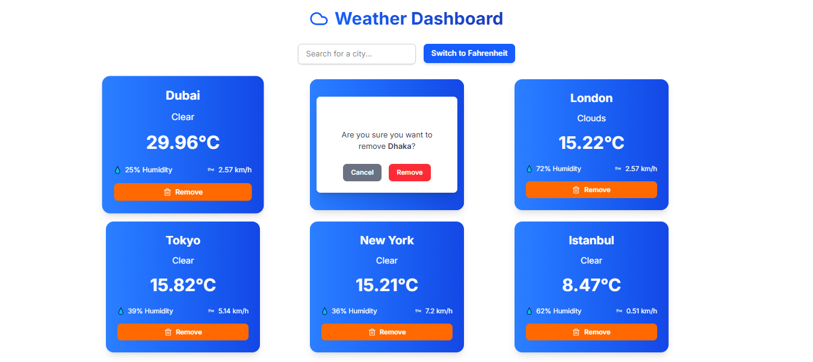

# Weather Dashboard 🌦️



A **responsive** and **user-friendly weather dashboard** built with **React** and **Tailwind CSS**. This app allows users to track weather information for multiple cities, toggle between **Celsius** and **Fahrenheit**, and dynamically add or remove cities from their dashboard.

## 🛠️ Features

- **Add/Remove Cities**: Easily add and remove cities from the dashboard.
- **Temperature Unit Toggle**: Switch between Celsius and Fahrenheit with a simple toggle.
- **Responsive Design**: Seamless experience across all screen sizes.
- **City Search with Autocomplete**: Search and add cities quickly using autocomplete functionality.
- **Weather Details**: Display key weather metrics: temperature, weather condition, humidity, and wind speed.
- **Persistent Data**: Cities are saved to `localStorage` for a persistent experience even after page refreshes.

## 🚀 Technologies Used

- **React**: A popular JavaScript library for building user interfaces.
- **Tailwind CSS**: A utility-first CSS framework for rapid UI development and responsive design.
- **OpenWeatherMap API**: Provides real-time weather data.
- **Lucide Icons**: A modern and clean icon library.

## 💻 Getting Started

### Prerequisites

Ensure you have the following installed:

- Node.js (v16 or higher)
- npm or yarn (package manager)

### Installation

1. **Clone the repository**:
   ```bash
   git clone https://github.com/your-username/weather-dashboard.git
2. Navigate to the project directory:
   ```bash
    cd weather-dashboard
3. Install dependencies:
   ```bash
    npm install
    # or
    yarn install
    ```
4. Set up environment variables: Create a .env file in the root directory and add your OpenWeatherMap API key:
   ```bash
    VITE_OPENWEATHERMAP_API_KEY=your_api_key_here
5. Start the development server:
   ```bash
    npm run dev
    # or
    yarn dev
    ```
6. Open your browser and navigate to http://localhost:3000.

## 🌐 Deployment

This app is deployed on Vercel. To deploy your own version:

1. Fork this repository.
2. Connect your GitHub account to Vercel.
3. Import the repository into Vercel.
4. Add the VITE_OPENWEATHERMAP_API_KEY environment variable in the Vercel dashboard.
5. Deploy your app to make it live.

## 🧑‍💻 Usage

- Add a City: Use the search bar to find and add a city to the dashboard.
- Remove a City: Click the "Remove" button on any city card to remove it.
- Toggle Units: Switch between Celsius and Fahrenheit using the toggle button.
- View Weather: Each city card displays the current temperature, weather condition, humidity, and wind speed.

## 📸 Screenshots




## 🤝 Contributing

Contributions are always welcome! Here's how you can contribute:

1. Fork the repository.
2. Create a new branch for your feature (git checkout -b feature/YourFeatureName).
3. Make your changes and commit them (git commit -m 'Add some feature').
4. Push your branch (git push origin feature/YourFeatureName).
5. Open a pull request to the main repository.

## 📝 License

This project is licensed under the MIT License. See the LICENSE file for details.

## 🙏 Acknowledgments

- OpenWeatherMap for providing the weather data API.
- Lucide Icons for the beautiful and clean icons.
- Tailwind CSS for the utility-first CSS framework that speeds up development.

## 📞 Contact

If you have any questions or feedback, feel free to reach out:

- Md. Shamim Hossain
- Email: shamimthedev@gmail.com
- GitHub: shamimthedev
- Portfolio: shamimthedev.vercel.app

### Made with ❤️ by Md. Shamim Hossain